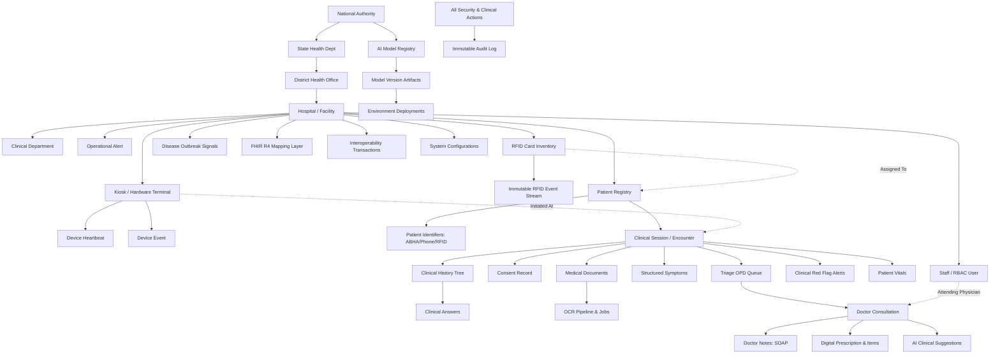

# MediKiosk — Database Finalization & Canonical Data Contract

**Status:** `FROZEN / ML-READY`  
**Standard:** SIH-PS-26047 National Scale AI Intake Platform  
**Target Engine:** CockroachDB Cloud (`v24.x` / PostgreSQL dialect via Prisma ORM)  
**Schema File:** `prisma/schema.prisma`  
**Physical Cloud Tables:** 49 Tables  
**Prisma Models:** 49 Models  
**Prisma Enums:** 35 Enums  
**Verification Status:** `14/14 Checks PASSED | 0 Warnings | 0 Failures`  
**Backend Tests:** `48/48 PASS`  
**Monorepo Production Builds:** `6/6 PASS`  

---

## 1. Executive Summary & Freeze Declaration

This document establishes the **authoritative and frozen database architecture** for MediKiosk (SIH-PS-26047). The database schema has been designed, validated against multi-tenant isolation requirements, migrated to CockroachDB Cloud, populated via an idempotent master seed script, audited via automated integrity checks, and verified across all 6 applications in the monorepo.

> [!IMPORTANT]
> **DATABASE FREEZE DIRECTIVE:**  
> The database schema is now considered **FROZEN**.  
> 1. All forthcoming Machine Learning (ML) and AI modules (Speech-to-Text, Vision OCR, Clinical Summarization, Triage Priority, and Outbreak Surveillance) must read and write strictly via this contract.  
> 2. No parallel or competing databases (MongoDB, Firebase, Supabase) may be introduced for clinical data.  
> 3. No core clinical or administrative entities (`Patient`, `PatientSession`, `RFIDCard`, `Doctor`, `Hospital`, `Alert`, etc.) may be duplicated.  
> 4. Any future schema alterations require an explicit formal architectural migration and justification.

---

## 2. Canonical Domain Architecture

MediKiosk models a nationwide healthcare intake and triage ecosystem across 17 distinct functional domains:



---

## 3. Physical Table & Model Inventory (49 Tables)

All 49 models are physically created, indexed, and operational in the CockroachDB Cloud cluster:

| # | Prisma Model | Physical Table Name | Primary Domain | Multi-Tenant Ownership |
|---|---|---|---|---|
| 1 | `NationalAuthority` | `NationalAuthority` | National Governance | Global (Root) |
| 2 | `State` | `State` | State Governance | National Authority |
| 3 | `District` | `District` | District Administration | State |
| 4 | `Hospital` | `Hospital` | Facility / Primary Tenant | District / State |
| 5 | `Department` | `Department` | Hospital Operations | Facility (`hospitalId`) |
| 6 | `Role` | `Role` | Security / RBAC | System Scope |
| 7 | `Permission` | `Permission` | Granular Privileges | System Scope |
| 8 | `RolePermission` | `RolePermission` | RBAC Matrix | `roleId` + `permissionId` |
| 9 | `UserRole` | `UserRole` | User Assignments | `doctorId` + `facilityId` |
| 10 | `Doctor` | `Doctor` | Staff Accounts | Facility (`hospitalId`) |
| 11 | `Patient` | `Patient` | Patient Master Index | Facility (`hospitalId`) |
| 12 | `PatientIdentifier` | `PatientIdentifier` | Multi-Modal KYC | Patient (`patientId`) |
| 13 | `RFIDCard` | `RFIDCard` | Smart Card Inventory | Facility (`hospitalId`) |
| 14 | `RFIDEvent` | `RFIDEvent` | Card Audit Trail | Facility (`facilityId`) |
| 15 | `RFIDDevice` | `RFIDDevice` | Hardware Terminals | Facility (`hospitalId`) |
| 16 | `DeviceHeartbeat` | `DeviceHeartbeat` | Kiosk Telemetry | Kiosk (`deviceId`) |
| 17 | `DeviceEvent` | `DeviceEvent` | Hardware Logs | Kiosk (`deviceId`) |
| 18 | `PatientSession` | `PatientSession` | Clinical Intake Encounter | Facility (`hospitalId`) |
| 19 | `Consent` | `Consent` | DPDP Patient Consent | Session (`sessionId`) |
| 20 | `ClinicalHistory` | `ClinicalHistory` | Intake Tree State | Session (`sessionId`) |
| 21 | `ClinicalAnswer` | `ClinicalAnswer` | ML Feature Answers | Clinical History |
| 22 | `PatientVitals` | `PatientVitals` | IoT/Manual Vitals | Session (`sessionId`) |
| 23 | `Questionnaire` | `Questionnaire` | Clinical Decision Tree | Global / Department |
| 24 | `Question` | `Question` | Adaptive Questions | Questionnaire |
| 25 | `SessionSymptom` | `SessionSymptom` | Structured Symptoms | Session (`sessionId`) |
| 26 | `MedicalDocument` | `MedicalDocument` | Uploaded Records | Session (`sessionId`) |
| 27 | `ExtractedMedicalData` | `ExtractedMedicalData` | OCR Extracted Fields | Document (`documentId`) |
| 28 | `OCRJob` | `OCRJob` | Vision Pipeline Tracking | Document (`documentId`) |
| 29 | `MedicalTimelineEvent` | `MedicalTimelineEvent` | Longitudinal Timeline | Patient (`patientId`) |
| 30 | `AISummary` | `AISummary` | Pre-Consultation Summary | Session (`sessionId`) |
| 31 | `TriageQueue` | `TriageQueue` | Live OPD Token Queue | Facility (`hospitalId`) |
| 32 | `Consultation` | `Consultation` | Physician Encounter | Session (`sessionId`) |
| 33 | `DoctorNote` | `DoctorNote` | SOAP Clinical Notes | Consultation |
| 34 | `AIAssistance` | `AIAssistance` | Diagnostic Suggestions | Session / Consultation |
| 35 | `Prescription` | `Prescription` | Digital Rx | Consultation |
| 36 | `PrescriptionItem` | `PrescriptionItem` | Rx Medicines & Dosage | Prescription |
| 37 | `Alert` | `Alert` | Clinical Red Flags | Session (`sessionId`) |
| 38 | `OperationalAlert` | `OperationalAlert` | Hardware/Fleet Alerts | Facility (`facilityId`) |
| 39 | `Notification` | `Notification` | In-App Alert Dispatch | Staff / Facility |
| 40 | `DiseaseOutbreakSignal` | `DiseaseOutbreakSignal` | Public Health Radar | Facility (`hospitalId`) |
| 41 | `AIModel` | `AIModel` | AI Registry Registry | National Governance |
| 42 | `AIModelVersion` | `AIModelVersion` | SemVer Weights & Metrics | Model (`modelId`) |
| 43 | `AIModelDeployment` | `AIModelDeployment` | Environment Serving | Version (`versionId`) |
| 44 | `AbdmConsentArtefact` | `AbdmConsentArtefact` | ABDM Gateway Consent | Patient (`patientId`) |
| 45 | `FHIRResourceMapping` | `FHIRResourceMapping` | FHIR R4 Bundle Store | Facility (`facilityId`) |
| 46 | `InteroperabilityTransaction` | `InteroperabilityTransaction`| ABDM Audit Log | Facility (`facilityId`) |
| 47 | `AuditLog` | `AuditLog` | Platform Audit Trail | Facility / Global |
| 48 | `SystemConfig` | `SystemConfig` | Runtime Parameters | Facility / Global |
| 49 | `OtpVerification` | `OtpVerification` | Auth / Verification | Ephemeral (Phone) |

---

## 4. Enumerations Contract (35 Enums)

The database utilizes strict CockroachDB enums to prevent invalid state entry:

1. `ConsentStatus`: `PENDING`, `GRANTED`, `DECLINED`, `REVOKED`
2. `DocumentType`: `PRESCRIPTION`, `LAB_REPORT`, `DISCHARGE_SUMMARY`, `OTHER`
3. `AlertSeverity`: `LOW`, `MEDIUM`, `HIGH`, `CRITICAL`
4. `RFIDCardStatus`: `MANUFACTURED`, `AVAILABLE`, `ASSIGNED`, `ACTIVE`, `SUSPENDED`, `LOST`, `STOLEN`, `BLOCKED`, `REPLACED`, `RETIRED`
5. `AIModelStatus`: `DRAFT`, `VALIDATING`, `APPROVED`, `STAGED`, `DEPLOYED`, `RETIRED`, `REJECTED`
6. `SessionStatus`: `CREATED`, `IDENTIFIED`, `CONSENTED`, `IN_HISTORY`, `DOCUMENTS`, `SUMMARY_READY`, `ROUTED`, `IN_CONSULT`, `COMPLETED`, `ABANDONED`
7. `Mode`: `GENERAL`, `AYUSH`
8. `Language`: `EN`, `HI`, `BN`, `MR`, `TE`, `TA`, `GU`, `KN`, `ML`, `PA`, `OR`, `AS`, `UR`
9. `ExtractionFieldStatus`: `VERIFIED`, `NEEDS_VERIFICATION`
10. `TimelineEventType`: `DIAGNOSIS`, `MEDICATION`, `INVESTIGATION`, `PROCEDURE`, `VISIT`
11. `ActorType`: `PATIENT`, `DOCTOR`, `ADMIN`, `SYSTEM`, `DEVICE`
12. `IdentificationMethod`: `RFID`, `QR`, `MANUAL`, `DEMO`
13. `AISummaryStatus`: `DRAFT`, `CONFIRMED`
14. `ConsultationStatus`: `PENDING`, `IN_PROGRESS`, `COMPLETED`
15. `DoctorRole`: `DOCTOR`, `ADMIN`, `HOSPITAL_ADMIN`, `RFID_OFFICER`, `CENTRAL_ADMIN`, `SUPER_ADMIN`
16. `HospitalType`: `AIIMS`, `TERTIARY_HOSPITAL`, `DISTRICT_HOSPITAL`, `COMMUNITY_HEALTH_CENTRE`, `PRIMARY_HEALTH_CENTRE`, `PRIVATE_HOSPITAL`
17. `TriagePriority`: `NORMAL`, `URGENT`, `EMERGENCY`
18. `QueueStatus`: `WAITING`, `CALLED`, `IN_CONSULTATION`, `COMPLETED`, `NO_SHOW`
19. `DoctorStatus`: `AVAILABLE`, `IN_CONSULTATION`, `OFF_DUTY`
20. `KioskStatus`: `ONLINE`, `DEGRADED`, `OFFLINE`
21. `PrescriptionFrequency`: `OD`, `BD`, `TDS`, `QID`, `PRN`, `SOS`
22. `QuestionType`: `SINGLE_CHOICE`, `MULTIPLE_CHOICE`, `TEXT`, `NUMBER`, `DATE`, `BOOLEAN`
23. `FacilityStatus`: `DRAFT`, `PENDING_APPROVAL`, `APPROVED`, `ACTIVE`, `SUSPENDED`, `INACTIVE`, `REJECTED`
24. `ScopeLevel`: `NATIONAL`, `STATE`, `DISTRICT`, `FACILITY`, `DEPARTMENT`
25. `IdentifierType`: `RFID`, `ABHA`, `PHONE`, `NATIONAL_ID`, `HOSPITAL_MRN`
26. `RFIDEventType`: `CARD_REGISTERED`, `CARD_ASSIGNED`, `CARD_ACTIVATED`, `CARD_BLOCKED`, `CARD_LOST`, `CARD_REPLACED`, `CARD_REISSUED`, `CARD_RETIRED`, `CARD_SCANNED`
27. `DeviceEventType`: `HEARTBEAT`, `ONLINE`, `OFFLINE`, `MAINTENANCE`, `DISABLED`, `ERROR`, `FIRMWARE_UPDATE`, `SCANNER_TRIGGER`
28. `OperationalAlertType`: `KIOSK_OFFLINE`, `RFID_READER_FAILURE`, `QUEUE_OVERLOAD`, `DEVICE_ERROR`, `NETWORK_LATENCY`, `PRINTER_PAPER_LOW`
29. `NoteType`: `SUBJECTIVE`, `OBJECTIVE`, `ASSESSMENT`, `PLAN`, `GENERAL`
30. `AIAssistanceType`: `SUMMARY`, `TRIAGE_ROUTING`, `DIAGNOSTIC_SUGGESTION`, `SAFETY_CHECK`
31. `DeploymentEnvironment`: `DEVELOPMENT`, `STAGING`, `PRODUCTION`
32. `DeploymentStatus`: `DRAFT`, `VALIDATING`, `APPROVED`, `STAGED`, `DEPLOYED`, `ROLLED_BACK`, `RETIRED`, `REJECTED`
33. `NotificationType`: `CLINICAL_ALERT`, `SYSTEM_ALERT`, `DEVICE_ALERT`, `QUEUE_ALERT`, `ADMIN_ALERT`
34. `InteropTransactionType`: `FHIR_BUNDLE_EXPORT`, `ABHA_LOOKUP`, `CONSENT_REQUEST`, `DISCHARGE_SUMMARY_PUSH`
35. `crdb_internal_region`: `aws_ap_south_1` (CockroachDB multi-region locality primitive)

---

## 5. Portal → API Route → Prisma Model Mapping

Each application in the MediKiosk monorepo interacts strictly with authoritative backend routes:

```text
PATIENT KIOSK (apps/patient-kiosk)
├── POST /api/rfid/scan               → RFIDDevice, RFIDCard, Patient, PatientSession
├── POST /api/otp/send & verify       → OtpVerification, Patient
├── POST /api/session/start           → PatientSession, Consent, AuditLog
├── POST /api/history/start & answer  → ClinicalHistory, ClinicalAnswer, Alert, SessionSymptom
├── POST /api/documents/scan          → MedicalDocument, OCRJob, ExtractedMedicalData
└── WS   /ws                          → Realtime session synchronization

DOCTOR DASHBOARD (apps/doctor-dashboard)
├── GET  /api/doctor/dashboard        → Doctor, TriageQueue, PatientSession, Alert
├── GET  /api/doctor/sessions/:id     → PatientSession, ClinicalHistory, MedicalDocument, AISummary
├── POST /api/doctor/alerts/:id/ack   → Alert (acknowledgedByDoctorId)
├── POST /api/doctor/consultation/*   → Consultation, DoctorNote, AIAssistance, Prescription
└── POST /api/doctor/ai-summary/review→ AISummary (status: CONFIRMED)

HOSPITAL ADMIN (apps/hospital-admin)
├── GET  /api/hospital-admin/stats    → Hospital, Doctor, PatientSession, Alert, TriageQueue
├── GET  /api/hospital-admin/fleet    → RFIDDevice, DeviceHeartbeat, OperationalAlert
├── POST /api/hospital-admin/doctors  → Doctor (status, roomNumber)
└── POST /api/hospital-admin/alerts/* → OperationalAlert (acknowledgedBy)

RFID PORTAL (apps/rfid-portal)
├── GET  /api/rfid-mgmt/cards         → RFIDCard, Patient, RFIDEvent
├── POST /api/rfid-mgmt/cards         → RFIDCard (MANUFACTURED -> AVAILABLE)
├── POST /api/rfid-mgmt/cards/:id/act → RFIDCard (ACTIVE), RFIDEvent
├── POST /api/rfid-mgmt/cards/:id/blk → RFIDCard (BLOCKED), RFIDEvent
└── POST /api/rfid-mgmt/cards/:id/rep → RFIDCard (REPLACED -> new card link), RFIDEvent

CENTRAL ADMIN (apps/central-admin)
├── GET  /api/admin/metrics           → NationalAuthority, State, District, Hospital, PatientSession
├── GET  /api/admin/outbreaks         → DiseaseOutbreakSignal
├── GET  /api/admin/ai-models         → AIModel, AIModelVersion, AIModelDeployment
├── POST /api/admin/ai-models/*       → AIModel governance, version promotion, deployment
└── GET  /api/admin/audit-logs        → AuditLog (cross-facility query)
```

---

## 6. Multi-Tenant Isolation & Hierarchical RBAC

Tenant isolation is enforced **server-side** at the route and service level via `userAuth.ts`:

1. **Hierarchy Anchoring:**
   Every clinical transaction (`PatientSession`, `TriageQueue`, `Alert`, `Consultation`, `RFIDCard`) carries a mandatory `hospitalId` / `facilityId`.
2. **Deterministic Scoping:**
   - **Central Admin:** Has `ScopeLevel.NATIONAL`. Reads across all facilities; can deploy global AI models and inspect national epidemiology signals.
   - **Hospital Admin:** Has `ScopeLevel.FACILITY`. Constrained strictly to `req.user.facilityId`. Cannot query or mutate records from other facilities.
   - **Doctor & Nurse:** Constrained to assigned department/facility and assigned active sessions.
   - **RFID Officer:** Constrained to facility RFID inventory.
   - **Kiosk Terminals:** Authenticate using pre-provisioned device keys (`x-device-key`), verified against `RFIDDevice.deviceCode`. Only initiates patient encounters scoped to that kiosk's hospital.

---

## 7. RFID Card Lifecycle & Event Ledger

The RFID subsystem avoids silent state mutation through an append-only event stream:

```text
[MANUFACTURED]
      │ (Batch import)
      ▼
 [AVAILABLE]
      │ (Assigned to Patient at Kiosk/Desk)
      ▼
  [ASSIGNED]
      │ (Activated with biometric/OTP KYC)
      ▼
   [ACTIVE] ──(Tapped at Kiosk)──> [CARD_SCANNED event logged]
      │
      ├──────────────────────┐
      │ (Reported Lost)      │ (Damaged / Replaced)
      ▼                      ▼
   [BLOCKED]            [REPLACED] ──> New RFIDCard created (Replaced card pointer)
      │
      ▼
  [RETIRED] (Final state)
```

- **Physical Card Immutability:** A card UID can never be silently reassigned.
- **Audit Ledger:** Every state change emits an `RFIDEvent` recording `actorId`, `facilityId`, `eventType`, `cardUid`, and timestamp.

---

## 8. Clinical vs. Operational Safety Separation

MediKiosk enforces absolute separation between clinical patient risks and hardware failures:

| Dimension | Clinical Red Flag (`Alert`) | Operational Incident (`OperationalAlert`) |
|---|---|---|
| **Trigger Source** | Deterministic clinical rules on patient answers / vitals | Kiosk daemon, background monitors, hardware drivers |
| **Examples** | Crushing chest pain, severe dyspnea, SpO2 < 90%, stroke signs | RFID reader disconnected, thermal printer paper out, network drop |
| **Recipients** | Attending Physicians, Triage Nurses, Emergency Desk | Hospital IT Staff, Facility Kiosk Maintenance Engineers |
| **Routing** | Elevates session triage priority to `EMERGENCY` | Marks terminal `DEGRADED` or `OFFLINE` in fleet monitor |
| **Resolution** | Physician clinical review and acknowledgement in consultation | Hardware repair, paper reload, technician acknowledgement |

---

## 9. Vision OCR & Multimodal Ingestion Pipeline

Prescriptions, lab reports, and identification documents are ingested asynchronously:

```text
Physical Document
      │ (Captured at Kiosk Camera / Scanner)
      ▼
MedicalDocument (Stored with ImageKit CDN path & MIME type)
      │
      ▼
   OCRJob (status: PENDING, provider: LOCAL / GEMINI_VISION)
      │
      ▼
OCR Processing & Normalization
      │
      ▼
ExtractedMedicalData (Structured key-value fields: medicine, dosage, lab values)
      │
      ▼
Physician Verification (status: NEEDS_VERIFICATION -> VERIFIED by Doctor)
```

- **Provenance Guarantee:** Raw OCR text and confidence scores (`ocrConfidence`) are preserved alongside structured extractions.
- **Human-in-the-Loop:** Unverified extractions are never committed as authoritative medical history without doctor review.

---

## 10. AI Model Registry & Governance Plane

The database establishes a comprehensive AI governance registry:

```text
AIModel (Registry entry e.g. "Clinical-Intake-Summarizer")
   │
   ▼
AIModelVersion (SemVer release e.g. "v2.1", artifact URL, CER/F1/Latency metrics)
   │
   ▼
AIModelDeployment (Target environment: DEV / STAGING / PROD, facility scoping, rollback reason)
```

- **Multi-Provider Support:** Supports on-device/local models, specialized ONNX models, and hosted LLM endpoints without hardcoded vendor locks.
- **Inference Traceability:** Every diagnostic suggestion or summary recorded in `AIAssistance` stores `modelVersion` and `provenanceReferences`.

---

## 11. Interoperability & FHIR R4 Boundary

To conform to Ayushman Bharat Digital Mission (ABDM) standards without distorting internal relational tables:

1. **Mapping Store (`FHIRResourceMapping`):**
   Maintains bidirectional links between MediKiosk internal UUIDs (`Patient.id`, `PatientSession.id`) and standard FHIR R4 resources (`Patient`, `Encounter`, `Condition`).
2. **Transaction Audit (`InteroperabilityTransaction`):**
   Logs every inbound and outbound ABDM gateway transaction with payloads, timestamps, and an explicit `DEMO` flag during non-production runs.

---

## 12. Indexing & Concurrency Strategy

1. **High-Velocity Compound Indexes:**
   - `PatientSession([hospitalId, status])` — live triage queues.
   - `RFIDCard([hospitalId, cardStatus])` — inventory and desk issuance.
   - `DeviceHeartbeat([deviceId, recordedAt])` — telemetry time-series queries.
   - `Alert([sessionId, severity])` — immediate triage red-flag popups.
   - `AuditLog([facilityId, createdAt])` — facility-scoped audit compliance queries.
2. **Database-Enforced Uniqueness:**
   - `PatientIdentifier([type, value])` — eliminates duplicate ABHA/Phone identities.
   - `Questionnaire([code])` and `Question([questionnaireId, nodeId])` — deterministic decision trees.
   - `RFIDCard([uid])` — absolute hardware uniqueness across the entire nation.

---

## 13. Data Retention & Immutability Rules

- **Append-Only Ledgers:** `AuditLog`, `RFIDEvent`, `DeviceHeartbeat`, `DeviceEvent`, and `InteroperabilityTransaction` are strictly append-only.
- **Soft State Transitions:** `RFIDCard`, `PatientSession`, and `Doctor` state updates record transition timestamps (`activatedAt`, `blockedAt`, `cardStatusChangedAt`, `calledAt`, `completedAt`).
- **Cascade Deletion Boundaries:** Cascades are restricted strictly to owned sub-items (e.g. `PrescriptionItem` cascades on `Prescription`, `RolePermission` cascades on `Role`). Core clinical records (`PatientSession`, `ClinicalHistory`, `Alert`) are protected against accidental cascaded drops.

---

## 14. Verification Results & Frozen Status

The database verification script was executed against the production CockroachDB cluster:

```bash
pnpm --filter backend run db:verify
```

```
================================================================
🔍 MEDIKIOSK DATABASE ARCHITECTURE VERIFICATION AUDIT
================================================================
✅ [ORGANIZATION] National Authority & State Hierarchy: Found National Health Authority with 4 states
✅ [ORGANIZATION] State -> District Hierarchy: Delhi has 2 districts mapped
✅ [FACILITY] Facility Hierarchy Linkage: AIIMS linked to State (Delhi) and District (South Delhi)
✅ [FACILITY] Hospital Departments: 7 active OPD clinics registered
✅ [RBAC] Roles & Normalized Permissions: 6 roles and 16 permissions registered
✅ [STAFF] Staff Accounts & Identity: 11 staff accounts operational with multi-role support
✅ [PATIENT] Patient Profiles & Normalized Identifiers: 11 patients registered
✅ [RFID] Smart Card Lifecycle & Event Stream: 8 cards in registry, 15 immutable events logged
✅ [HARDWARE] Kiosk Fleet & Telemetry Stream: 12 terminals online with heartbeat telemetry
✅ [CLINICAL] Questionnaire & Decision Trees: 1 questionnaire trees with 3 structured questions
✅ [SAFETY] Operational Alert Separation: 3 operational incidents tracked independently from clinical alerts
✅ [AI_GOVERNANCE] Multi-tier Model Registry: 16 models, 12 version artifacts, 6 active deployments
✅ [INTEROPERABILITY] FHIR R4 & ABDM Layer: 1 FHIR resources mapped with DEMO status; 3 transactions recorded
✅ [CONFIG] System Configurations: 4 platform and kiosk configurations active

================================================================
AUDIT RESULTS: 14 PASSED | 0 WARNINGS | 0 FAILED
================================================================
```

### Monorepo Validation:
- **Backend Tests:** 48 / 48 tests passing (`vitest run --testTimeout=15000`).
- **Application Builds:** 6 / 6 apps compiled successfully for production (`pnpm -r build`).

**FINAL STATUS:** **FROZEN / READY FOR ML INTEGRATION**
